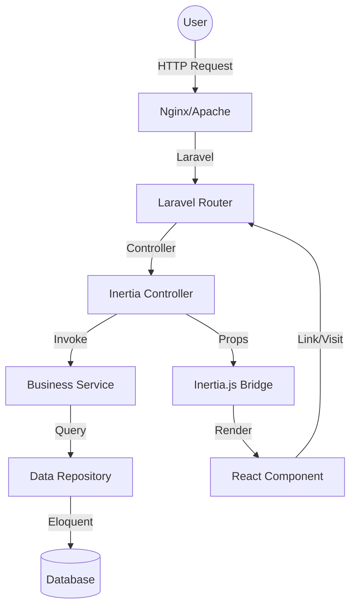

# Technical Design Document: Global Motion Migration & Enhancement

## Overview

This document outlines the technical design for migrating Global Motion from Next.js to Laravel 13 with a React frontend powered by Inertia.js. The migration focuses on building a robust backend architecture, improving data integrity through normalized database schemas, and enhancing the UI/UX with modern design principles ("UI/UX Pro Max").

### Key Objectives
- **Full-Stack Integration**: Utilize Laravel 13 as a powerful backend and React as a dynamic frontend via Inertia.js.
- **Improved Security**: Implement Laravel Fortify for authentication and robust authorization.
- **Data Integrity**: Normalize database schemas for shipments, quotes, and tracking events.
- **Enhanced UX**: Apply animations, glassmorphism, and consistent design tokens for a professional feel.
- **Scalability**: Implement Service and Repository patterns to keep business logic separate and maintainable.

## Architecture

The system follows a classic MVC architecture adapted for modern SPAs using Inertia.js.

### System Components
- **Backend (Laravel 13)**:
  - **Controllers**: Handle HTTP requests and return Inertia responses.
  - **Services**: Contain the core business logic (e.g., shipment status transitions, quote calculations).
  - **Repositories**: Abstract the data access layer using Eloquent models.
  - **Fortify**: Handles authentication, registration, and 2FA.
  - **Inertia Middleware**: Shares global data (auth user, flash messages) with the frontend.
- **Frontend (React 18)**:
  - **Pages**: React components that correspond to Laravel routes.
  - **Components**: Reusable UI elements (Buttons, Cards, Forms) using Tailwind CSS.
  - **Inertia Link/Head**: Manage client-side navigation and meta tags.
- **Communication Layer (Inertia.js)**:
  - Eliminates the need for a separate REST API for the main application.
  - Passes data from Laravel controllers directly to React props.

### Data Flow Diagram



## Components and Interfaces

### Backend Structure
- `app/Http/Controllers/`: Standard controllers for web pages.
- `app/Http/Controllers/Api/`: (Optional) Controllers for external tracking integrations.
- `app/Services/`: Classes like `ShipmentService`, `QuoteService`, `TrackingService`.
- `app/Repositories/`: Classes like `ShipmentRepository`, `UserRepository`.
- `app/Http/Requests/`: Form Requests for validation (e.g., `StoreQuoteRequest`).
- `app/Http/Resources/`: (Optional) For consistent API responses.

### Frontend Components (React)
- **Layouts**:
  - `MainLayout`: Navbar, Footer, and side-padding for standard pages.
  - `AdminLayout`: Sidebar-based navigation for management tasks.
- **Core Components**:
  - `ShipmentCard`: Displays brief shipment info.
  - `TrackingTimeline`: Visual representation of shipment events.
  - `QuoteForm`: Interactive form with real-time validation feedback.
  - `GlassCard`: Reusable glassmorphism styled container.
  - `SkeletonLoader`: For async data states.

## Data Models

### Database Schema

#### Users
| Column | Type | Description |
|--------|------|-------------|
| id | UUID | Primary Key |
| name | String | User's full name |
| email | String | Unique email address |
| password | String | Hashed password |
| role | Enum | 'customer', 'admin' |
| email_verified_at | Timestamp | For verification status |
| two_factor_secret | Text | Encrypted 2FA secret |
| remember_token | String | For persistent sessions |

#### Shipments
| Column | Type | Description |
|--------|------|-------------|
| id | UUID | Primary Key |
| user_id | UUID | Foreign Key to Users |
| tracking_number| String | Unique (e.g., GM-847291) |
| origin | String | Origin city/port |
| destination | String | Destination city/port |
| service_type | Enum | 'Air', 'Ocean', 'Road' |
| weight | Decimal | Weight in kg |
| status | Enum | 'Pending', 'In Transit', 'Customs', 'Delivered', 'Cancelled' |
| estimated_delivery| Timestamp | Projected delivery date |

#### Timeline Events
| Column | Type | Description |
|--------|------|-------------|
| id | BigInt | Primary Key |
| shipment_id | UUID | Foreign Key to Shipments |
| event_type | String | e.g., 'Picked Up', 'Departed' |
| location | String | Current location |
| description | Text | Detailed status update |
| timestamp | Timestamp | When the event occurred |

#### Quotes
| Column | Type | Description |
|--------|------|-------------|
| id | UUID | Primary Key |
| user_id | UUID | Foreign Key to Users |
| origin | String | Origin city/port |
| destination | String | Destination city/port |
| weight | Decimal | Weight in kg |
| service_type | Enum | 'Air', 'Ocean', 'Road' |
| estimated_cost | Decimal | Calculated cost |
| status | Enum | 'Pending', 'Calculated', 'Accepted', 'Rejected', 'Expired' |
| expires_at | Timestamp | 7-day expiration |

## Correctness Properties

*A property is a characteristic or behavior that should hold true across all valid executions of a system-essentially, a formal statement about what the system should do. Properties serve as the bridge between human-readable specifications and machine-verifiable correctness guarantees.*

### Property 1: Role-Based Authorization Invariant
*For any* restricted resource or action, only users with the required role (e.g., 'admin' for creating shipments) shall be granted access, while all other users and unauthenticated requests shall be rejected with 403 Forbidden or redirected to login.
**Validates: Requirements 2.7, 2.8, 2.9, 7.3, 7.12, 10.7, 10.8, 10.9, 10.10**

### Property 2: Shipment Tracking Accessibility
*For any* valid tracking number in the system, any user (authenticated or unauthenticated) shall be able to retrieve the shipment's basic status and timeline, but sensitive data (documents, invoices) shall be restricted to the shipment's owner or admins.
**Validates: Requirements 5.1, 5.11, 5.12**

### Property 3: Quote to Shipment Transformation
*For any* quote that is accepted by a customer, the system shall create a corresponding shipment record that accurately reflects the origin, destination, service type, and weight from the original quote.
**Validates: Requirements 6.8**

### Property 4: Quote Validation & Weight Limits
*For any* quote request, if the weight exceeds the defined limit for the selected service type (Air, Ocean, Road), the system shall reject the request and return a validation error.
**Validates: Requirements 6.12**

### Property 5: Search Consistency
*For any* search query against shipments or quotes, the returned results shall only include items that match the search criteria (e.g., tracking number, origin, or destination) and belong to the requesting user (unless the user is an admin).
**Validates: Requirements 7.8, 8.11, 12.1, 12.2, 12.3, 12.4**

### Property 6: Consistent API/Inertia Response Format
*For any* request to the backend, the system shall return a response with a consistent structure (status, data, message) and appropriate HTTP status codes corresponding to the outcome (200 for success, 422 for validation errors, etc.).
**Validates: Requirements 10.11, 10.12, 13.3**

### Property 7: Data Integrity (Cascade Deletion)
*For any* shipment that is deleted from the system (if not using soft deletes), all associated timeline events shall be automatically removed from the database.
**Validates: Requirements 9.5**

## Error Handling

- **Validation Errors**: Laravel's Form Requests will handle input validation. Errors will be passed back as Inertia props and displayed under respective form fields in React.
- **Authentication Errors**: Fortify handles login/registration failures.
- **Authorization Errors**: `403 Forbidden` responses will be handled by a global error boundary in React to show a user-friendly "Access Denied" page.
- **Not Found**: Tracking numbers not found will return a specific error message within the tracking component rather than a generic 404 page.
- **Server Errors**: 500 errors will be logged via Laravel's logging system and a generic "Something went wrong" page will be displayed to users.

## Testing Strategy

The project employs a dual testing approach to ensure both specific functionality and universal correctness.

### Unit & Feature Testing (PHPUnit/Pest)
- **Authentication**: Test login, registration, and 2FA flows.
- **Authorization**: Verify RBAC logic for admin and customer routes.
- **Shipment/Quote Logic**: Test services for status transitions and cost calculations.
- **API Endpoints**: Feature tests for all controller actions to verify status codes and JSON structure.

### Property-Based Testing (PhpQuickCheck / Fast-check)
- **Applicability**: PBT is used for core logic such as quote calculations, status state machines, and data transformation resources.
- **Configuration**: Minimum 100 iterations per property.
- **Coverage**: Focus on the properties defined in the "Correctness Properties" section.
  - *Example*: **Feature: laravel-react-migration-enhancement, Property 4: Quote Validation & Weight Limits** - Generate random weights and service types to verify validation logic.

### UI & E2E Testing (Playwright)
- **Responsive Design**: Verify layout across mobile, tablet, and desktop breakpoints.
- **Critical Flows**: Test tracking search, quote submission, and admin dashboard interactions.
- **UI/UX**: Check animations, glassmorphism visibility in light mode, and accessibility (ARIA labels).


## UI/UX Enhancement Details

### Design System (Material Design 3 Inspired)

The existing Next.js application already has a well-defined design system in `globals.css`. This design system will be preserved and enhanced during migration.

#### Color Tokens (Preserved from Next.js)
```css
--color-primary: #002444 (Deep Navy)
--color-on-primary: #ffffff
--color-secondary: #bc000c (Red)
--color-on-secondary: #ffffff
--color-tertiary: #745b00 (Gold)
--color-surface: #f7f9fb (Light Gray)
--color-on-surface: #191c1e
--color-status-success: #10B981
--color-status-warning: #F59E0B
--color-status-error: #EF4444
```

#### Typography System (Preserved)
- **Display**: Hanken Grotesk (48px, 800 weight, -0.02em tracking)
- **Headline**: Hanken Grotesk (24-32px, 700 weight)
- **Body**: Inter (16-18px, 400 weight)
- **Label**: Inter (12-14px, 500-600 weight)
- **Monospace**: JetBrains Mono (for tracking numbers)

#### Spacing System (8px Base Unit)
```css
--spacing-base: 8px
--spacing-gutter: 24px
--spacing-margin-mobile: 16px
--spacing-margin-desktop: 64px
--spacing-container-max: 1280px
```

### UI/UX Pro Max Principles Implementation

#### 1. Smooth Animations & Transitions
- **Duration**: 150-300ms for all transitions
- **Easing**: Use `ease-in-out` or custom cubic-bezier for natural motion
- **Hover States**: 
  ```css
  transition: all 200ms ease-in-out;
  ```
- **Micro-interactions**: Button press (scale-95), card hover (shadow increase)

#### 2. Glassmorphism Effects
- **Light Mode**: Minimum `bg-white/80` or `bg-white/85` for readability
- **Backdrop Blur**: `backdrop-filter: blur(12px)`
- **Border**: `border: 1px solid rgba(226, 232, 240, 0.5)`
- **Example**:
  ```jsx
  <div className="bg-white/85 backdrop-blur-md border border-gray-200/50 rounded-xl">
  ```

#### 3. Icon System (NO Emojis)
- **Primary Library**: Heroicons or Lucide React
- **Sizes**: Consistent 20px (text-xl) or 24px (text-2xl)
- **Usage**:
  ```jsx
  import { TruckIcon, MapPinIcon } from '@heroicons/react/24/outline';
  <TruckIcon className="w-6 h-6 text-primary" />
  ```

#### 4. Interactive Elements
- **Cursor**: All clickable elements must have `cursor-pointer`
- **Focus States**: Visible ring for keyboard navigation
  ```css
  focus:outline-none focus:ring-2 focus:ring-primary focus:ring-offset-2
  ```
- **Disabled States**: Reduced opacity (0.5) and `cursor-not-allowed`

#### 5. Floating Navbar
- **Positioning**: `top-4 left-4 right-4` with `fixed` or `sticky`
- **Background**: Glassmorphism with shadow
- **Example**:
  ```jsx
  <nav className="fixed top-4 left-4 right-4 z-50 bg-white/90 backdrop-blur-md rounded-xl shadow-lg">
  ```

#### 6. Loading States
- **Skeleton Loaders**: For async content (shipment cards, timeline)
- **Spinner**: For form submissions
- **Progress Indicators**: For multi-step processes
- **Example**:
  ```jsx
  {loading ? (
    <div className="animate-pulse bg-gray-200 h-24 rounded-lg" />
  ) : (
    <ShipmentCard data={shipment} />
  )}
  ```

#### 7. Form Validation Feedback
- **Real-time**: Validate on blur or after first submission attempt
- **Error Display**: Red text with icon below field
- **Success State**: Green border or checkmark icon
- **Example**:
  ```jsx
  {errors.email && (
    <p className="mt-1 text-sm text-red-600 flex items-center gap-1">
      <ExclamationCircleIcon className="w-4 h-4" />
      {errors.email}
    </p>
  )}
  ```

#### 8. Responsive Breakpoints
- **Mobile**: 375px - 767px
- **Tablet**: 768px - 1023px
- **Desktop**: 1024px - 1439px
- **Large Desktop**: 1440px+

#### 9. Accessibility (WCAG 2.1 AA)
- **Color Contrast**: Minimum 4.5:1 for body text, 3:1 for large text
- **Keyboard Navigation**: All interactive elements accessible via Tab
- **ARIA Labels**: For icon-only buttons and complex widgets
- **Focus Management**: Trap focus in modals, restore on close
- **Reduced Motion**: Respect `prefers-reduced-motion` media query

### Component Design Specifications

#### Tracking Timeline Component
```jsx
<div className="relative">
  {/* Progress Line */}
  <div className="absolute left-4 top-4 bottom-4 w-0.5 bg-gray-200" />
  
  {/* Active Progress */}
  <div className="absolute left-4 top-4 h-1/2 w-0.5 bg-red-600" />
  
  {/* Events */}
  {events.map((event, index) => (
    <div key={event.id} className="flex gap-6 relative mb-8">
      {/* Status Indicator */}
      <div className={`w-8 h-8 rounded-full flex items-center justify-center z-10 shrink-0 ${
        event.completed 
          ? 'bg-red-600 border-4 border-white' 
          : 'bg-gray-100 border-4 border-white border-gray-300'
      }`}>
        {event.completed && (
          <CheckIcon className="w-4 h-4 text-white" />
        )}
      </div>
      
      {/* Event Details */}
      <div className="pt-1">
        <h3 className="font-semibold text-gray-900">{event.type}</h3>
        <p className="text-gray-600">{event.location}</p>
        <p className="text-sm text-gray-500 mt-1">{event.timestamp}</p>
      </div>
    </div>
  ))}
</div>
```

#### Glass Card Component
```jsx
const GlassCard = ({ children, className = '' }) => (
  <div className={`
    bg-white/85 backdrop-blur-md 
    border border-gray-200/50 
    rounded-xl shadow-sm 
    hover:shadow-md transition-shadow duration-200
    ${className}
  `}>
    {children}
  </div>
);
```

#### Shipment Status Badge
```jsx
const statusColors = {
  'Pending': 'bg-yellow-100 text-yellow-800',
  'In Transit': 'bg-blue-100 text-blue-800',
  'Customs': 'bg-purple-100 text-purple-800',
  'Delivered': 'bg-green-100 text-green-800',
  'Cancelled': 'bg-red-100 text-red-800',
};

<span className={`
  inline-flex items-center gap-1 px-3 py-1 rounded-full 
  text-xs font-semibold
  ${statusColors[status]}
`}>
  <span className="w-2 h-2 rounded-full bg-current" />
  {status}
</span>
```

#### Quote Form with Validation
```jsx
<form onSubmit={handleSubmit} className="space-y-6">
  <div>
    <label className="block text-sm font-medium text-gray-700 mb-1">
      Origin Port/City
    </label>
    <input
      type="text"
      value={data.origin}
      onChange={e => setData('origin', e.target.value)}
      className={`
        w-full px-4 py-3 rounded-lg border
        focus:outline-none focus:ring-2 focus:ring-primary
        transition-colors duration-200
        ${errors.origin 
          ? 'border-red-500 focus:ring-red-500' 
          : 'border-gray-300 focus:ring-primary'
        }
      `}
      placeholder="e.g. Shanghai, CN"
    />
    {errors.origin && (
      <p className="mt-1 text-sm text-red-600 flex items-center gap-1">
        <ExclamationCircleIcon className="w-4 h-4" />
        {errors.origin}
      </p>
    )}
  </div>
  
  <button
    type="submit"
    disabled={processing}
    className="
      w-full bg-primary text-white py-3 rounded-lg
      font-semibold
      hover:bg-primary-dark
      active:scale-95
      disabled:opacity-50 disabled:cursor-not-allowed
      transition-all duration-200
      flex items-center justify-center gap-2
    "
  >
    {processing ? (
      <>
        <ArrowPathIcon className="w-5 h-5 animate-spin" />
        Processing...
      </>
    ) : (
      <>
        Calculate Estimate
        <ArrowRightIcon className="w-5 h-5" />
      </>
    )}
  </button>
</form>
```

## API & Data Flow

### Inertia.js Request/Response Cycle

#### 1. Initial Page Load
```
User → Browser → Laravel Route → Controller → Inertia::render()
→ Root Blade Template (app.blade.php) → React Hydration
```

#### 2. Subsequent Navigation (Client-Side)
```
User clicks Link → Inertia.visit() → XHR to Laravel
→ Controller → Inertia::render() → JSON Response
→ React Component Update (No Full Reload)
```

#### 3. Form Submission
```
User submits form → Inertia.post() → Laravel Controller
→ Validation (Form Request) → Service Layer → Repository
→ Database → Redirect with Flash Message → React Update
```

### Controller Example: Tracking
```php
<?php

namespace App\Http\Controllers;

use App\Services\TrackingService;
use Illuminate\Http\Request;
use Inertia\Inertia;

class TrackingController extends Controller
{
    public function __construct(
        private TrackingService $trackingService
    ) {}
    
    public function index()
    {
        return Inertia::render('Tracking/Index');
    }
    
    public function show(string $trackingNumber)
    {
        $shipment = $this->trackingService
            ->findByTrackingNumber($trackingNumber);
        
        if (!$shipment) {
            return back()->with('error', 'Tracking number not found');
        }
        
        return Inertia::render('Tracking/Show', [
            'shipment' => $shipment,
            'timeline' => $shipment->timelineEvents()
                ->orderBy('timestamp', 'desc')
                ->get(),
        ]);
    }
}
```

### Service Layer Example: Quote Calculation
```php
<?php

namespace App\Services;

use App\Models\Quote;
use App\Repositories\QuoteRepository;

class QuoteService
{
    public function __construct(
        private QuoteRepository $quoteRepository
    ) {}
    
    public function calculateCost(array $data): float
    {
        // Base rates per kg
        $rates = [
            'Air' => 5.50,
            'Ocean' => 1.20,
            'Road' => 2.80,
        ];
        
        $baseRate = $rates[$data['service_type']] ?? 0;
        $weight = $data['weight'];
        
        // Distance multiplier (simplified)
        $distanceMultiplier = $this->calculateDistance(
            $data['origin'],
            $data['destination']
        );
        
        return round($baseRate * $weight * $distanceMultiplier, 2);
    }
    
    public function createQuote(array $data): Quote
    {
        $estimatedCost = $this->calculateCost($data);
        
        return $this->quoteRepository->create([
            ...$data,
            'estimated_cost' => $estimatedCost,
            'status' => 'Pending',
            'expires_at' => now()->addDays(7),
        ]);
    }
    
    public function acceptQuote(Quote $quote): void
    {
        // Convert quote to shipment
        $shipment = app(ShipmentService::class)->createFromQuote($quote);
        
        $quote->update([
            'status' => 'Accepted',
            'shipment_id' => $shipment->id,
        ]);
    }
    
    private function calculateDistance(string $origin, string $destination): float
    {
        // Simplified: In production, use geocoding API
        return 1.5;
    }
}
```

### Repository Pattern Example
```php
<?php

namespace App\Repositories;

use App\Models\Shipment;
use Illuminate\Database\Eloquent\Collection;

class ShipmentRepository
{
    public function findByTrackingNumber(string $trackingNumber): ?Shipment
    {
        return Shipment::where('tracking_number', $trackingNumber)
            ->with('timelineEvents')
            ->first();
    }
    
    public function findByUser(int $userId): Collection
    {
        return Shipment::where('user_id', $userId)
            ->with('timelineEvents')
            ->orderBy('created_at', 'desc')
            ->get();
    }
    
    public function create(array $data): Shipment
    {
        return Shipment::create([
            ...$data,
            'tracking_number' => $this->generateTrackingNumber(),
        ]);
    }
    
    public function updateStatus(Shipment $shipment, string $status): void
    {
        $shipment->update(['status' => $status]);
        
        // Create timeline event
        $shipment->timelineEvents()->create([
            'event_type' => "Status changed to {$status}",
            'location' => $shipment->current_location ?? 'Unknown',
            'description' => "Shipment status updated",
            'timestamp' => now(),
        ]);
    }
    
    private function generateTrackingNumber(): string
    {
        return 'GM-' . strtoupper(substr(uniqid(), -10));
    }
}
```

### React Page Example: Tracking
```jsx
import { Head, Link } from '@inertiajs/react';
import MainLayout from '@/Layouts/MainLayout';
import TrackingTimeline from '@/Components/TrackingTimeline';
import ShipmentDetails from '@/Components/ShipmentDetails';
import { TruckIcon } from '@heroicons/react/24/outline';

export default function Show({ shipment, timeline }) {
  return (
    <MainLayout>
      <Head title={`Track ${shipment.tracking_number}`} />
      
      <div className="max-w-7xl mx-auto px-4 sm:px-6 lg:px-8 py-12">
        <div className="grid grid-cols-1 lg:grid-cols-3 gap-8">
          {/* Main Content */}
          <div className="lg:col-span-2 space-y-8">
            {/* Shipment Header */}
            <div className="bg-white/85 backdrop-blur-md border border-gray-200/50 rounded-xl p-6 shadow-sm">
              <div className="flex items-center justify-between mb-4">
                <div>
                  <h1 className="text-2xl font-bold text-gray-900">
                    {shipment.tracking_number}
                  </h1>
                  <StatusBadge status={shipment.status} />
                </div>
                <TruckIcon className="w-12 h-12 text-primary" />
              </div>
              
              <ShipmentDetails shipment={shipment} />
            </div>
            
            {/* Timeline */}
            <div className="bg-white/85 backdrop-blur-md border border-gray-200/50 rounded-xl p-6 shadow-sm">
              <h2 className="text-xl font-bold text-gray-900 mb-6">
                Shipment Timeline
              </h2>
              <TrackingTimeline events={timeline} />
            </div>
          </div>
          
          {/* Sidebar */}
          <div className="lg:col-span-1">
            <div className="sticky top-24 space-y-6">
              {/* Help Card */}
              <div className="bg-primary text-white rounded-xl p-6 shadow-lg">
                <h3 className="text-lg font-bold mb-2">Need Help?</h3>
                <p className="text-sm text-blue-100 mb-4">
                  Our support team is available 24/7
                </p>
                <Link
                  href="/support"
                  className="block w-full bg-white text-primary text-center py-2 rounded-lg font-semibold hover:bg-gray-100 transition-colors duration-200"
                >
                  Contact Support
                </Link>
              </div>
            </div>
          </div>
        </div>
      </div>
    </MainLayout>
  );
}
```

## Integration

### Tracking API Simulation

For development and testing, a simulated tracking API will be implemented to generate realistic shipment updates.

```php
<?php

namespace App\Services;

use App\Models\Shipment;
use Illuminate\Support\Facades\Cache;

class TrackingSimulatorService
{
    private array $locations = [
        'Air' => [
            'Shanghai Pudong Airport, CN',
            'Hong Kong International Airport, HK',
            'Los Angeles International Airport, US',
            'Distribution Center, Los Angeles, US',
        ],
        'Ocean' => [
            'Port of Shanghai, CN',
            'Singapore Port, SG',
            'Port of Los Angeles, US',
            'Customs Clearance, US',
        ],
        'Road' => [
            'Warehouse, Shanghai, CN',
            'Highway Checkpoint, Jiangsu, CN',
            'Distribution Hub, Beijing, CN',
            'Final Destination',
        ],
    ];
    
    public function simulateProgress(Shipment $shipment): void
    {
        $cacheKey = "shipment_simulation_{$shipment->id}";
        $currentStep = Cache::get($cacheKey, 0);
        
        $locations = $this->locations[$shipment->service_type] ?? [];
        
        if ($currentStep < count($locations)) {
            $shipment->timelineEvents()->create([
                'event_type' => $this->getEventType($currentStep),
                'location' => $locations[$currentStep],
                'description' => $this->getDescription($currentStep, $shipment->service_type),
                'timestamp' => now(),
            ]);
            
            Cache::put($cacheKey, $currentStep + 1, now()->addDays(7));
            
            // Update shipment status
            $this->updateShipmentStatus($shipment, $currentStep, count($locations));
        }
    }
    
    private function getEventType(int $step): string
    {
        return match($step) {
            0 => 'Picked Up',
            1 => 'In Transit',
            2 => 'Customs Clearance',
            3 => 'Out for Delivery',
            default => 'Delivered',
        };
    }
    
    private function updateShipmentStatus(Shipment $shipment, int $step, int $total): void
    {
        if ($step === 0) {
            $shipment->update(['status' => 'In Transit']);
        } elseif ($step === $total - 2) {
            $shipment->update(['status' => 'Customs']);
        } elseif ($step === $total - 1) {
            $shipment->update(['status' => 'Delivered']);
        }
    }
}
```

### Notification System

Email notifications will be sent for key events using Laravel's notification system.

```php
<?php

namespace App\Notifications;

use App\Models\Shipment;
use Illuminate\Bus\Queueable;
use Illuminate\Notifications\Messages\MailMessage;
use Illuminate\Notifications\Notification;

class ShipmentStatusUpdated extends Notification
{
    use Queueable;
    
    public function __construct(
        private Shipment $shipment,
        private string $newStatus
    ) {}
    
    public function via($notifiable): array
    {
        return ['mail', 'database'];
    }
    
    public function toMail($notifiable): MailMessage
    {
        return (new MailMessage)
            ->subject("Shipment {$this->shipment->tracking_number} Update")
            ->greeting("Hello {$notifiable->name},")
            ->line("Your shipment status has been updated to: {$this->newStatus}")
            ->line("Tracking Number: {$this->shipment->tracking_number}")
            ->action('Track Shipment', url("/tracking/{$this->shipment->tracking_number}"))
            ->line('Thank you for choosing Global Motion!');
    }
    
    public function toArray($notifiable): array
    {
        return [
            'shipment_id' => $this->shipment->id,
            'tracking_number' => $this->shipment->tracking_number,
            'status' => $this->newStatus,
        ];
    }
}
```

### Real-Time Updates (Polling Strategy)

For real-time tracking updates, implement a polling mechanism on the frontend:

```jsx
import { useEffect, useState } from 'react';
import { router } from '@inertiajs/react';

export default function TrackingShow({ shipment, timeline }) {
  const [isPolling, setIsPolling] = useState(true);
  
  useEffect(() => {
    if (!isPolling || shipment.status === 'Delivered') return;
    
    const interval = setInterval(() => {
      router.reload({ only: ['shipment', 'timeline'] });
    }, 30000); // Poll every 30 seconds
    
    return () => clearInterval(interval);
  }, [isPolling, shipment.status]);
  
  return (
    // Component JSX
  );
}
```

## Migration Strategy

### Phase 1: Backend Setup
1. Install Laravel 13 with Inertia.js and React
2. Configure database and run migrations
3. Set up Laravel Fortify for authentication
4. Implement Repository and Service patterns
5. Create controllers and routes

### Phase 2: Database Migration
1. Create migration files for all tables
2. Set up model relationships
3. Create seeders for development data
4. Test data integrity constraints

### Phase 3: Frontend Migration
1. Set up React with Inertia.js
2. Migrate design tokens from `globals.css` to Tailwind config
3. Create shared layouts (MainLayout, AdminLayout)
4. Convert Next.js pages to Inertia pages one by one:
   - Home page
   - Services page
   - Tracking page
   - Admin dashboard
   - Customer portal

### Phase 4: Component Migration
1. Convert Next.js components to React components
2. Replace Next.js Image with standard img or Inertia-compatible solution
3. Replace Next.js Link with Inertia Link
4. Implement UI/UX enhancements (glassmorphism, animations)

### Phase 5: Testing & QA
1. Write unit tests for services and repositories
2. Write feature tests for controllers
3. Implement property-based tests for core logic
4. Conduct browser testing (Chrome, Firefox, Safari)
5. Test responsive design on real devices

### Phase 6: Deployment
1. Set up production environment
2. Configure environment variables
3. Run database migrations
4. Deploy application
5. Monitor logs and performance

## Pre-Delivery Checklist

Before considering the migration complete, verify:

### Visual Quality
- [ ] No emojis used as icons (use Heroicons/Lucide)
- [ ] All icons from consistent icon set
- [ ] Brand logos are correct
- [ ] Hover states don't cause layout shift
- [ ] Design tokens properly migrated from globals.css

### Interaction
- [ ] All clickable elements have `cursor-pointer`
- [ ] Hover states provide clear visual feedback
- [ ] Transitions are smooth (150-300ms)
- [ ] Focus states visible for keyboard navigation
- [ ] Loading states implemented for async operations

### Light/Dark Mode
- [ ] Light mode text has sufficient contrast (4.5:1 minimum)
- [ ] Glass/transparent elements visible in light mode (bg-white/80+)
- [ ] Borders visible in both modes
- [ ] Test both modes before delivery

### Layout
- [ ] Floating navbar has proper spacing (top-4 left-4 right-4)
- [ ] No content hidden behind fixed navbars
- [ ] Responsive at 375px, 768px, 1024px, 1440px
- [ ] No horizontal scroll on mobile

### Functionality
- [ ] Authentication flows work (login, register, 2FA, password reset)
- [ ] Authorization properly restricts admin routes
- [ ] Tracking works for valid and invalid tracking numbers
- [ ] Quote submission and calculation work correctly
- [ ] Email notifications are sent for key events
- [ ] Form validation provides clear feedback

### Performance
- [ ] Lighthouse score > 90
- [ ] Images optimized and lazy-loaded
- [ ] Database queries optimized (N+1 prevention)
- [ ] Assets minified and compressed

### Security
- [ ] CSRF protection enabled
- [ ] XSS protection (input sanitization)
- [ ] SQL injection protection (parameterized queries)
- [ ] Rate limiting configured
- [ ] HTTPS enforced in production

### Accessibility
- [ ] All images have alt text
- [ ] Form inputs have labels
- [ ] Color is not the only indicator
- [ ] `prefers-reduced-motion` respected
- [ ] ARIA labels for icon-only buttons
